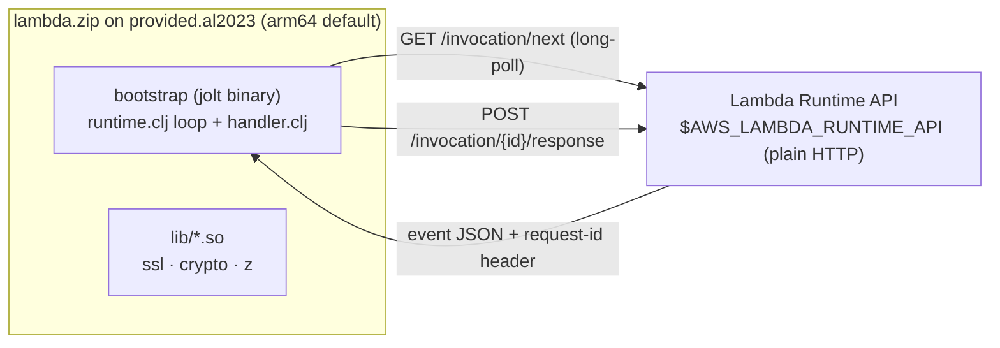

# lambda-mvp-jlt: AWS Lambda custom runtime in Jolt

Run [Jolt](https://github.com/jolt-lang/jolt) (native Clojure on Chez Scheme,
no JVM) on AWS Lambda as a **custom runtime**, the same `provided.al2023`
contract that [awslabs/aws-lambda-cpp](https://github.com/awslabs/aws-lambda-cpp)
implements for C++, here implemented in ~60 lines of Clojure over Jolt's
built-in HTTP client. `joltc build` compiles the handler *and* the runtime
loop into one self-contained native executable named `bootstrap`; the zip is
that binary plus a `lib/` of non-glibc shared objects.

This is a deliberately small extraction: a demo handler (greet + echo +
warm-invocation counter) and a `jolt bench` tool for comparing cold vs. warm
boot time across memory tiers, reproducible against **your own AWS
account**. No function URL, no bearer auth, no public HTTP endpoint:
everything here is `aws lambda invoke`.

## Status

This is an early release. Jolt itself, and the ecosystem around it
(`jolt-lang/http-client`, the AL2023 build recipe, the custom-runtime pattern
this repo demonstrates), are all still evolving. Task names, defaults, and
even the shape of `jolt bench`'s output may change without a deprecation
period. Pin a commit or tag if you depend on the current behavior staying
exactly as it is.

## How it works



A Lambda **custom runtime** is any Linux executable named `bootstrap` that
speaks the Runtime API (version `2018-06-01`), plain HTTP on a loopback
address with no TLS: long-poll `GET /invocation/next` (event JSON in the body,
request id in a response header), run the handler, `POST` the result to
`/invocation/{id}/response`.

- `src/net/b12n/lambda_mvp/runtime.clj`: the Runtime API loop. Generic;
  takes any `(fn [event-json ctx])`.
- `src/net/b12n/lambda_mvp/handler.clj`: the demo handler: greeting +
  raw-event echo + warm-invocation counter. Swap in your own.
- `src/net/b12n/lambda_mvp/main.clj`: `-main`, the `joltc build` target.
- `tools/mock_runtime_api.py`: offline mock of the Runtime API, so the
  whole loop is testable without AWS or Docker.
- `Dockerfile`: Amazon Linux 2023 build. Chez v10.4.1 from source (kernel
  dev files for `joltc build`), jolt from source (the prebuilt Linux joltc
  needs glibc ≥ 2.35; AL2023, and the Lambda environment, is **2.34**),
  then `joltc build -m net.b12n.lambda-mvp.main -o bootstrap` and an
  ldd-audited `lib/` bundle.

See `docs/guide/runtime-api-loop.md` for the loop's design notes and
`docs/guide/al2023-build.md` for the glibc constraint and the build recipe.

## Requirements

- [jolt](https://github.com/jolt-lang/jolt) on PATH (`brew install jolt-lang/jolt/jolt`). Every command below is `jolt <task>`: jolt's task runner reads this project's `bb.edn` directly.
- [babashka](https://babashka.org) too. Several tasks (`test`, `deploy`, `invoke`, `teardown`, `bench`, the `site:*` tasks) shell out to a real `bb` binary internally for `clojure.test`/`cheshire`, neither of which jolt bundles, so it's still a real requirement even though you'll mostly type `jolt`.
- Docker, AWS CLI v2.
- An AWS account and credentials the `aws` CLI can already use:
  `AWS_PROFILE`/`AWS_REGION` env vars, or `aws configure`. **Nothing in this
  repo hardcodes a profile, account, or region.** Every task below uses
  whatever your CLI already resolves.

## Quickstart

```sh
jolt probe        # offline e2e: mock Runtime API + demo handler (no AWS, no Docker)
jolt test         # run script/bench.clj's unit tests (no AWS, no Docker)
jolt demo         # image + deploy + invoke in one go, prerequisites checked first
jolt image        # AL2023 Docker build -> dist/bootstrap + dist/lambda.zip (arm64 default)
jolt deploy       # idempotent: create/update the IAM role + Lambda function
jolt invoke       # single ad-hoc invoke, prints the response body + REPORT line
jolt bench        # cold/warm boot-time comparison across memory tiers
jolt teardown     # delete the function + role when you're done
```

`jolt image` builds for arm64 unless `LAMBDA_ARCH=x86_64` (or `amd64`) is set.
Use that on an x86_64 Linux host without qemu, where an arm64 build fails with
`exec format error`. `jolt deploy` picks up the architecture from the built
binary. `jolt deploy`'s IAM role (`lambda-mvp-jlt-role`) and function
(`lambda-mvp-jlt`) names are overridable via `LAMBDA_MVP_FUNCTION_NAME`.
`jolt bench`'s memory tiers and warm-sample count are overridable via
`BENCH_MEMORY_TIERS` (default `2048,3008`) and `BENCH_WARM_SAMPLES`
(default `5`).

## Cold vs. warm boot time

See [`docs/guide/cold-warm-boot.md`](docs/guide/cold-warm-boot.md) for what
`jolt bench` measures, how to read the table it prints, and the source
research project's own measured numbers, reproduced here as **illustrative,
not a live guarantee**. Your numbers will differ by account, region, and the
hardware allocation AWS happens to give you. Run `jolt bench` for your own.

## Restricted networks (proxy that 403s container registries / release assets)

### `docker build` fails at `FROM` with `Forbidden`

Fetch the base image out-of-band over direct HTTPS and point the build at it:

```sh
brew install crane
crane pull --platform linux/arm64 public.ecr.aws/amazonlinux/amazonlinux:2023 /tmp/al2023.tar   # linux/amd64 with LAMBDA_ARCH=x86_64
docker load -i /tmp/al2023.tar
docker tag public.ecr.aws/amazonlinux/amazonlinux:2023 my-local/amazonlinux:2023
BASE_IMAGE=my-local/amazonlinux:2023 jolt image
```

### Upgrading local `joltc`/`jolt` fails with a 403 on the release tarball

jolt's `install` script (and a plain `curl` of any
`github.com/.../releases/download/...` URL) redirects to
`release-assets.githubusercontent.com`, a **different host** from
`objects.githubusercontent.com`, so it can still 403 through a proxy
allowlist that only covers the latter. Run the install with the proxy env
unset for that one command:

```sh
env -u HTTP_PROXY -u HTTPS_PROXY -u http_proxy -u https_proxy \
  bash install --dir /usr/local/bin --version 0.8.7   # run from a jolt checkout
```

## Extension points

Not built here, but straightforward follow-ups if you need them:

- A function URL + bearer token, for an HTTP-reachable demo instead of
  `aws lambda invoke` only.
- A second, dependency-heavier handler, to isolate binary-size effects on
  cold init independent of the jolt-version comparison `jolt bench` already
  lets you reproduce.

## References

- [Jolt](https://github.com/jolt-lang/jolt) · [jolt examples](https://github.com/jolt-lang/examples)
- [AWS Lambda Runtime API / custom runtimes](https://docs.aws.amazon.com/lambda/latest/dg/runtimes-custom.html)
- [awslabs/aws-lambda-cpp](https://github.com/awslabs/aws-lambda-cpp): the C++
  implementation of the same contract

## License

EPL 2.0, see `LICENSE`.
