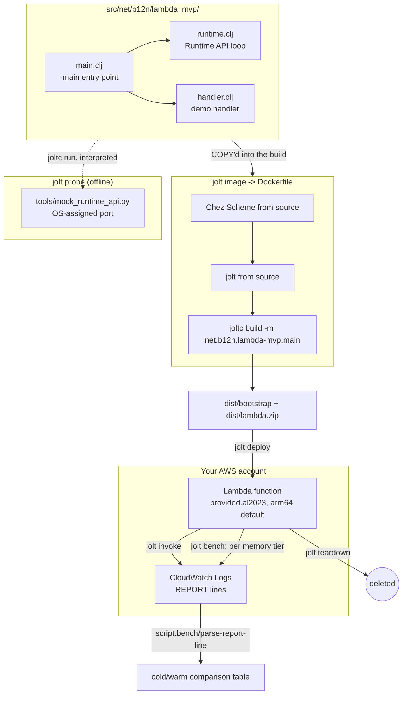

# Architecture

This page is the whole-system view: how the runtime loop, the Docker build, and the two babashka-driven tools (AWS lifecycle, bench) fit together. Each piece has its own deep-dive page linked from here; this page is the map, not the territory.

## The whole flow

## The Runtime API loop

`src/net/b12n/lambda_mvp/{runtime,handler,main}.clj` is the whole custom runtime: a poll/execute/respond loop against the Lambda Runtime API, a demo handler, and the `-main` entry point `joltc build` compiles. It's generic: `runtime/run` takes any `(fn [event-json ctx]) -> json-string`, so swapping in your own handler means writing one new namespace and pointing `main.clj` at it.

See [The Runtime API loop](runtime-api-loop.md) for the full contract, the design notes behind `:throw-exceptions false`, and how `tools/mock_runtime_api.py` makes runtime-loop changes a two-second local iteration via `jolt probe`.

## The build

`jolt image` runs a multi-stage Docker build that compiles Chez Scheme and jolt from source on Amazon Linux 2023, the same OS Lambda's `provided.al2023` execution environment runs, because AL2023's glibc (2.34) is older than what jolt's prebuilt Linux binary needs (2.35 or newer). The output is a self-contained `bootstrap` executable plus a `lib/` directory of every non-glibc shared library it links or dlopens.

See [Building on Amazon Linux 2023](al2023-build.md) for the glibc constraint in full, the recipe's five steps, and the packaging gotchas (`which`, `xxd`) that cost a build round each in the original research project.

## The AWS lifecycle tool

`script/aws_lifecycle.clj` is a small, generic (no hardcoded profile, account, or region) idempotent create-or-update-or-delete tool, driven entirely by whatever the caller's own `aws` CLI already has configured. `deploy!` creates the IAM role and Lambda function on first run and updates them on every later run; `invoke!` runs a single ad-hoc invocation; `teardown!` deletes both. `jolt deploy`/`jolt invoke`/`jolt teardown` are thin wrappers around it.

`deploy!` never reads `LAMBDA_ARCH` itself. It reads the architecture out of the ELF header of the `dist/bootstrap` `jolt image` last built and passes `--architectures` on both create and update, so a deploy always matches the binary on disk and can flip an existing function's architecture on a later run.

Every mutating AWS call checks its own exit code and fails loudly with the AWS CLI's own error text rather than reporting success on a call that actually failed. That discipline came from live testing during this project's own development: an early version silently reported a successful teardown even when a delete call had failed.

## `jolt demo`: the same flow, one command

`jolt demo` (`script/demo.clj`) runs `image`, `deploy` and `invoke` in order, after checking tools on PATH, AWS credentials and region, Docker daemon access, and that Docker can actually run containers for the target `LAMBDA_ARCH`. It's the same pieces described above, just sequenced with every failure mode checked up front instead of surfacing mid-build.

## The bench tool

`script/bench.clj` holds the pure logic: `parse-report-line` turns a CloudWatch `REPORT` line into a Clojure map, and `format-table` renders a comparison across memory tiers as markdown. Neither function does any I/O, which is what makes them unit-testable via `jolt test` with no AWS account involved.

`script/bench_run.clj` is the orchestration: for each memory tier, it changes the function's configured memory (which forces a fresh execution environment on the next invoke), measures one cold sample and several warm ones, and calls `format-table` on the results. It also checks the AWS response's `FunctionError` field before trusting anything else in it, since `aws lambda invoke` returns a successful exit code even when the function itself crashes.

See [Cold vs. warm boot](cold-warm-boot.md) for what the resulting table means, and the recipe for reproducing a jolt-version comparison against your own account.

## Why `load-file`, not `:require`, between the two bench files

`script/bench_run.clj` loads `script/bench.clj` via `(load-file "script/bench.clj")` rather than a normal `:require`. This isn't a style choice: a `script/`-relative namespace doesn't resolve reliably across every way this project's babashka tasks invoke a script (a `bb.edn` task's own classpath, and a direct `bb script/foo.clj` run), so `load-file` as its own top-level form, followed by fully-qualified calls, is the pattern verified to work in both. The same constraint is why `script/aws_lifecycle.clj` and `script/bench_run.clj` each carry their own small `sh`/`die!` helper rather than sharing one: a third shared-helper file would need the same `load-file` chain to reach either of them.

## See also

- [Contributing](contributing.md): build, test, and PR conventions.
- [Project README](https://github.com/b12n-oss/lambda-mvp-jlt/blob/main/README.md): the same quickstart in prose.
